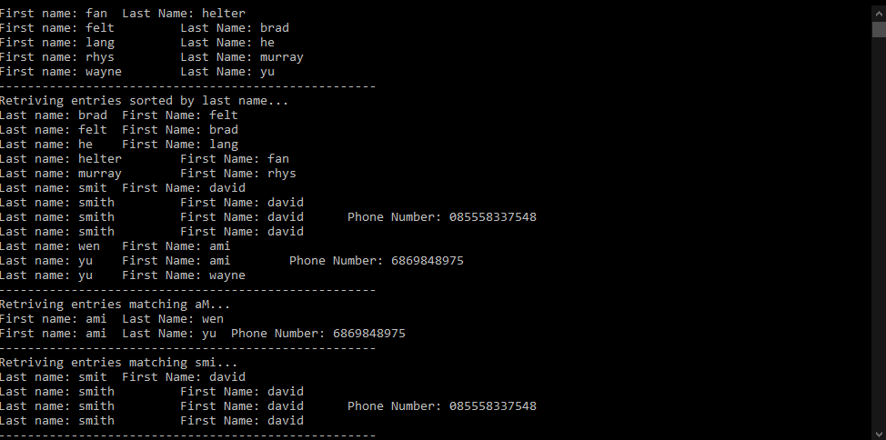

# Address-Book

## Information:
Created using Visual Studio Code.

* Compiled app can be found in the `Release.7z` file in the root directory of the repo in case of any compilation or environment issues.
* To build this project, simply run a build cycle with cmake for your desired envrionment.

## Design Choices:

* For this address book I decided to use a multiset. This allows duplicates (people often have the same names) and makes the system more flexible in future.
* Using the multiset means we can take advantage of O(log(n)) insertion, lookup and removal times. With the other advantage that the set keeps itself sorted which allows for
quick lookups when matching to a specific set of names as given in the last requirment. 
* I have written this as a console application since the requirements demand some brevity with regards to development time and focussed mainly on creating an efficient lookup system
* The lookup for the each entry should be (O(log n)) when dealing with first names, the intention behind this is that when this type of lookup is done, there is generally a 
 preference for last or first name which we could change easily from a design perspective. So we can set which is the more common lookup to our default. The reason last names won't
 be as fast is because for sorting by last name we need to create a copy of the set where the set is then sorted by lastname which will slow things down. However, on the whole this
 will still likely be very fast when comparing to other structures such as vectors or lists. Ideally an undordered set would be used for faster access speed, but the overhead of then
 sorting the values makes it a waste of computation. I think therefore that a set structure is a good middle ground for this application.
 
 * Functionality specifics are documented in the classes themselves.

## Requirements:
### Create a simple program in the language of your choice that meets the following requirements:
- [x] Entries should contain:
	A first and/or last name (you can treat each character as a single byte, i.e. no need to support Unicode).
	An optional phone number.
Functionality to:
- [x] Add an entry
- [x] Remove an entry
- [x] Retrieve entries in alphabetical order, sorted by first name.
- [x] Retrieve entries in alphabetical order, sorted by first name.
- [x] Retrieve entries whose first or last name exactly or partially match a supplied search string,
	  from the beginning of the name (e.g. searching for “Dan” would match any entries with
	  “Daniel” as well as any “Dan”).

## Image:

